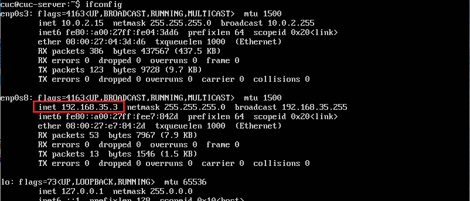
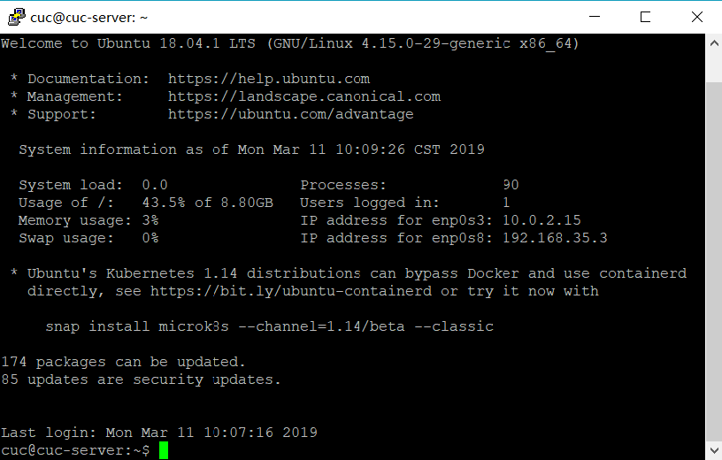
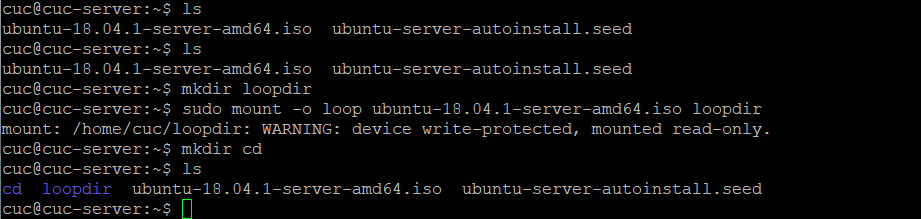
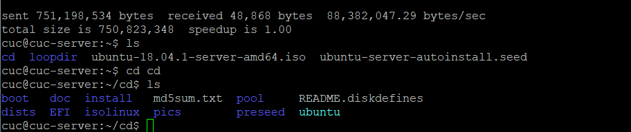
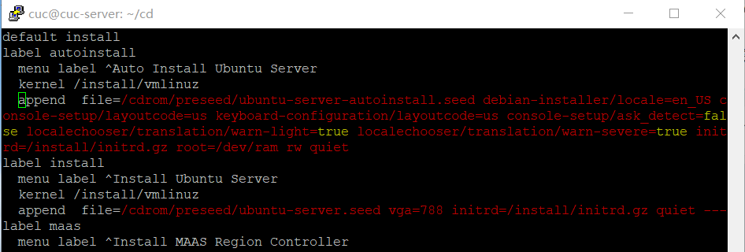
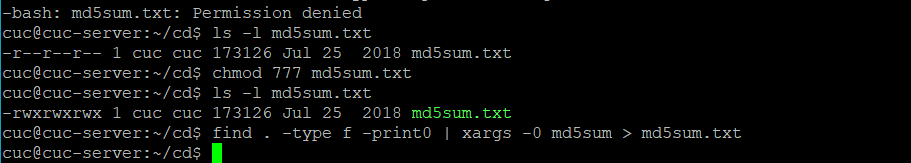
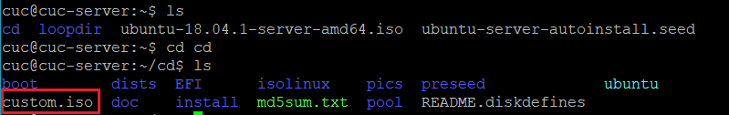
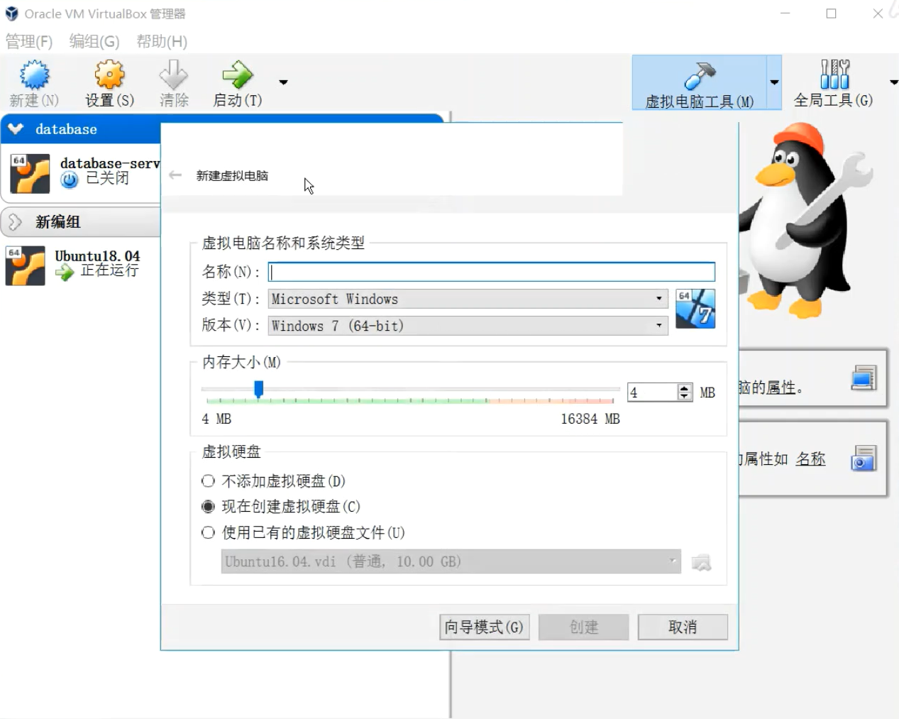
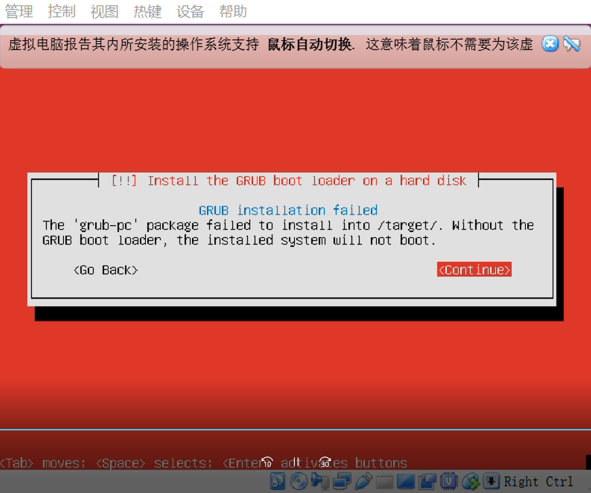

# 实验一 无人值守安装Ubuntu18.04.1

## 1. 实验环境

- 虚拟机： VIrtualBox 5.2.18 r124319
- 镜像：[ubuntu-18.04.1-server-amd64.iso](http://sec.cuc.edu.cn/ftp/iso/ubuntu-18.04.1-server-amd64.iso)
- Putty

## 2. 实验要求

- 制作Ubuntu无人值守镜像并安装

## 3. 实验步骤

### step 1 在虚拟机手动安装Ubuntu 18.04，并通过Putty连接，用于制作无人值守安装镜像

- 手工安装UBuntu18.04，主机名为cuc-server，创建一个名为cuc的用户

- 配置双网卡

  - `sudo vi /etc/netplan/01-netcfg.yaml` 内容如下

    ```bash
    # This file describes the network interfaces available on your system
    # For more information, see netplan(5).
    network:
      version: 2
      renderer: networkd
      ethernets:
        enp0s3:
          dhcp4: yes
        enp0s8:
          dhcp5: yes
    ```
    - `sudo netplan apply` , 之后查看网卡已经启用

      

- 通过Putty连接Ubuntu

  

### step 2 拷贝一份CD文件

- `put ubuntu-18.04.1-server-amd64.iso` 使用psftp 将镜像传送到cuc-server

- `mkdir loopdir`  在当前用户目录下创建一个用于挂载iso镜像文件的目录

- `sudo mount -o loop ubuntu-18.04.1-server-amd64.iso loopdir`  挂载iso镜像文件到该目录

- `mkdir cd` 

	

- `rsync -av loopdir/ cd`  同步光盘内容到cd文件夹下,下图显示内容已经同步

	

- `sudo umount loopdir` 卸载iso镜像

### step 3 制作镜像

- 在Ubuntu安装引导界面增加一个菜单项入口
	`sudo vi isolinux/txt.cfg`

	在default install下添加以下内容

     ```bash
      label autoinstall
              menu label ^Auto Install Ubuntu Server
              kernel /install/vmlinuz
              append  file=/cdrom/preseed/ubuntu-server-autoinstall.seed debian-installer/locale=en_US console-setup/layoutcode=us keyboard-configuration/layoutcode=us console-setup/ask_detect=false localechooser/translation/warn-light=true localechooser/translation/warn-severe=true initrd=/install/initrd.gz root=/dev/ram rw quiet
     ```
    如下图

-  基于[官方preseed示例](https://help.ubuntu.com/lts/installation-guide/example-preseed.txt)制作preseed文件, 之前已经通过psftp传入，编写后输入`x!`退出,preseed文件需要存放在cd/preseed文件夹下

- `sudo vi isolinux/isolinux.cfg`，修改timeout为10 

- 在cd文件夹下执行`find . -type f -print0 | xargs -0 md5sum > md5sum.txt ` 重新生成md5sum.txt，直接执行时没有权限，因此执行`chmod 777 md5sum.txt`

	
	
- 重新生成custom.iso

```bash
IMAGE=custom.iso
BUILD=/home/cuc/cd/
sudo mkisofs -r -V "Custom Ubuntu Install CD" \
                        -cache-inodes \
                        -J -l -b isolinux/isolinux.bin \
                        -c isolinux/boot.cat -no-emul-boot \
                        -boot-load-size 4 -boot-info-table \
                        -o $IMAGE $BUILD
```



### step 4 新建虚拟机，实现无人值守安装

[](https://weibo.com/tv/v/HkpQ47QxK?fid=1034:4348658330885308)

## 4. 遇到的问题

- 使用 psftp 从虚拟机get文件时候被拒绝，通过把Putty文件夹挪到没有空格没有中文的路径下之后就能成功 (从C:\Program Files\Putty移动到C:\Putty，Program Files之间有空格)

  

- 编写preseed之后，并没有一开始就完全实现无人值守,通过不断修改安装过程中出现的需要手工操作的选项,最终实现。下图出现的问题在preseed中添加以下语句之后解决
  ```
  ### Package selection
  tasksel tasksel/first multiselect server
  #tasksel tasksel/first multiselect lamp-server, print-server
  #tasksel tasksel/first multiselect kubuntu-desktop
  
  # Individual additional packages to install
  d-i pkgsel/include string openssh-server build-essential
  # Whether to upgrade packages after debootstrap.
  # Allowed values: none, safe-upgrade, full-upgrade
  d-i pkgsel/upgrade select none
  ```
  

## 参考

- [CUCCS/linux/blob/master/2017-1/FitzBC](https://github.com/CUCCS/linux/blob/master/2017-1/FitzBC/%E5%AE%9E%E9%AA%8C1/%E5%AE%9E%E9%AA%8C%E6%8A%A5%E5%91%8A1_20170228.md)
- [CUCCS/linux-2019-TheMasterOfMagic/](https://github.com/CUCCS/linux-2019-TheMasterOfMagic/pull/1/commits/ff2775a44a166d6d886edf8999920884ae1bd780)


