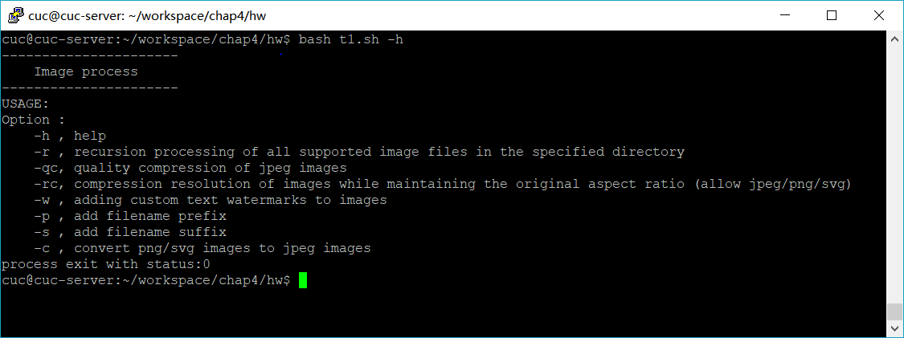
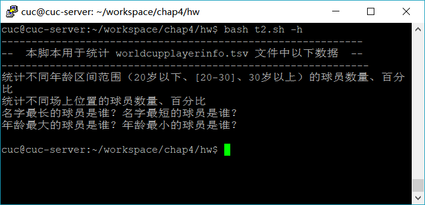
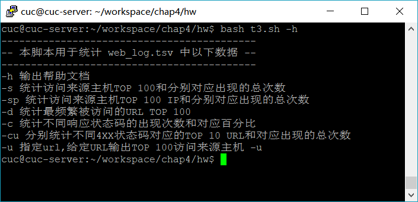

# 实验四：shell脚本编程基础

> Don't repeat yourself

## 实验环境

- Ubuntu 18.04

- ImageMagick 6.9.7-4 Q16 x86_64 20170114

  ```bash
  sudo apt-get update
  sudo apt install imagemagick-6.q16
  ```

## 实验要求

- 任务一：用bash编写一个图片批处理脚本，实现以下功能： 
  - 支持命令行参数方式使用不同功能
  - 支持对指定目录下所有支持格式的图片文件进行批处理
  - 支持以下常见图片批处理功能的单独使用或组合使用 
    - 支持对jpeg格式图片进行图片质量压缩
    - 支持对jpeg/png/svg格式图片在保持原始宽高比的前提下压缩分辨率
    - 支持对图片批量添加自定义文本水印
    - 支持批量重命名（统一添加文件名前缀或后缀，不影响原始文件扩展名）
    - 支持将png/svg图片统一转换为jpg格式图片

------

- 任务二：用bash编写一个文本批处理脚本，对以下附件分别进行批量处理完成相应的数据统计任务： 
  - [2014世界杯运动员数据](https://github.com/c4pr1c3/LinuxSysAdmin/blob/master/exp/chap0x04/worldcupplayerinfo.tsv)
    - 统计不同年龄区间范围（20岁以下、[20-30]、30岁以上）的球员**数量**、**百分比**
    - 统计不同场上位置的球员**数量**、**百分比**
    - 名字最长的球员是谁？名字最短的球员是谁？
    - 年龄最大的球员是谁？年龄最小的球员是谁？

------

- 任务二：用bash编写一个文本批处理脚本，对以下附件分别进行批量处理完成相应的数据统计任务： 
  - [Web服务器访问日志](https://github.com/c4pr1c3/LinuxSysAdmin/blob/master/exp/chap0x04/web_log.tsv.7z)
    - 统计访问来源主机TOP 100和分别对应出现的总次数
    - 统计访问来源主机TOP 100 IP和分别对应出现的总次数
    - 统计最频繁被访问的URL TOP 100
    - 统计不同响应状态码的出现次数和对应百分比
    - 分别统计不同4XX状态码对应的TOP 10 URL和对应出现的总次数
    - 给定URL输出TOP 100访问来源主机

------

## 完成情况

详见Travis

- 任务一

```bash
# convert 基本使用
#支持对jpeg格式图片进行图片质量压缩
convert -quality 75% input.jpg output.jpg  
# 保持原始宽高比的前提下压缩分辨率
convert -resize widthxheight input output
# 支持将png/svg图片统一转换为jpg格式图片
convert test.png test.jpg
# 加文字水印
convert cuc.jpg -gravity southeast -font font.ttf -fill white -pointsize 32 -draw 'text 5,5 "CUCCS"' cucwm.jpg

```

  


- 任务二

  

- 任务三

  

  

## 参考

- https://blog.csdn.net/z1037561063/article/details/80410060

- [2017-1/HJJ/ex4](https://github.com/CUCCS/linux/blob/master/2017-1/HJJ/ex4/shellcode3.sh#L32)

- [2017-1/FitzBC](https://github.com/CUCCS/linux/tree/master/2017-1/FitzBC/%E5%AE%9E%E9%AA%8C4)

- [CUCCS/linux-2019-jckling/pull/4](https://github.com/CUCCS/linux-2019-jckling/pull/4/commits/5f29b9a38c0851f4dd5491c573978a948b50e11f)

- [https://blog.csdn.net/Hello_Ray/article/details/83786776](https://blog.csdn.net/Hello_Ray/article/details/83786776)


